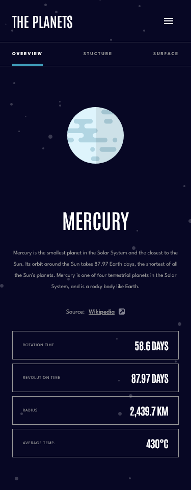

# Frontend Mentor - Planets fact site solution

This is a solution to the [Planets fact site challenge on Frontend Mentor](https://www.frontendmentor.io/challenges/planets-fact-site-gazqN8w_f). Frontend Mentor challenges help you improve your coding skills by building realistic projects.

## Table of contents

- [Overview](#overview)
  - [The challenge](#the-challenge)
  - [Screenshot](#screenshot)
  - [Links](#links)
  - [Built with](#built-with)
  - [What I learned](#what-i-learned)
- [Author](#author)

## Overview

### The challenge

Users should be able to:

- View the optimal layout for the app depending on their device's screen size
- See hover states for all interactive elements on the page
- View each planet page and toggle between "Overview", "Internal Structure", and "Surface Geology"

### Screenshot





### Links

- Solution URL: [Github](https://github.com/oloude)
- Live Site URL: [Planets Fact Site](https://planets-fact-app.netlify.app/)

## My process

### Built with

- Semantic HTML5 markup
- Flexbox
- Mobile-first workflow
- [React](https://reactjs.org/) - JS library
- [Typescript](https://www.typescriptlang.org/) - JavaScript with syntax for types.
- [React Router](https://reactrouter.com/) - For routing

### What I learned

Use this section to recap over some of your major learnings while working through this project. Writing these out and providing code samples of areas you want to highlight is a great way to reinforce your own knowledge.

To see how you can add code snippets, see below:

```js
function App() {
  return (
    <BrowserRouter>
      <Routes>
        <Route path="/" element={<Planet />} />
        <Route path="/:planet" element={<Planet />} />
      </Routes>
    </BrowserRouter>
  );
}

type Contentmenuprops = {
  handleMenuoption: (menuValue: string, imageValue: string) => void,
  menuOption: string,
};

function ContentMenu({ handleMenuoption, menuOption }: Contentmenuprops) {
  const { planet } = useParams();

  let color =
    planet === "Mercury"
      ? "after:bg-green"
      : planet === "Venus"
      ? "after:bg-yellow"
      : planet === "Earth"
      ? "after:bg-earthLine"
      : planet === "Mars"
      ? "after:bg-orange500"
      : planet === "Jupiter"
      ? "after:bg-red"
      : planet === "Saturn"
      ? "after:bg-orange400"
      : planet === "Uranus"
      ? "after:bg-cyan"
      : planet === "Neptune"
      ? "after:bg-blue"
      : "after:bg-green";

  return (
    <article className="border-b border-b-slate700 py-4 px-6 flex justify-between md:hidden">
      <div
        onClick={() => handleMenuoption("overview", "planet")}
        className={`${
          menuOption === "overview"
            ? `text-white relative after:content-[] after:absolute after:w-full after:h-1  after:-bottom-4 after:left-0 ${color}`
            : "text-slate700"
        } text-[9px] font-bold tracking-[1.93px] uppercase`}
      >
        overview
      </div>
      <div
        onClick={() => handleMenuoption("structure", "internal")}
        className={`${
          menuOption === "structure"
            ? `text-white relative after:content-[] after:absolute after:w-full after:h-1  after:-bottom-4 after:left-0 ${color}`
            : "text-slate700"
        } text-[9px] font-bold tracking-[1.93px] uppercase`}
      >
        stucture
      </div>
      <div
        onClick={() => handleMenuoption("geology", "geology")}
        className={`${
          menuOption === "geology"
            ? `text-white relative after:content-[] after:absolute after:w-full after:h-1  after:-bottom-4 after:left-0 ${color}`
            : "text-slate700"
        } text-[9px] font-bold tracking-[1.93px] uppercase`}
      >
        surface
      </div>
    </article>
  );
}
```

## Author

- Frontend Mentor - [@oloude](https://www.frontendmentor.io/profile/oloude)
- Twitter - [@abosedeoloude](https://www.twitter.com/abosedeoloude)
